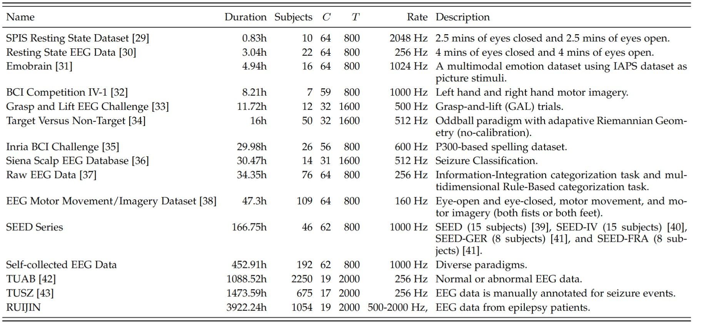

# Gram
This is the code of Gram:"Gram: A Large-Scale General EEG Model for Raw Data Classification and Restoration Tasks".

Please cite:

>@ARTICLE{11271181,
  author={Li, Zi-Yi and Zheng, Wei-Long and Xu, Jiwen and Lu, Yong and Lu, Bao-Liang},
  journal={IEEE Transactions on Affective Computing}, 
  title={Gram: A Large General EEG Model for Raw Data Classification and Restoration}, 
  year={2025},
  volume={},
  number={},
  pages={1-16},
  keywords={Electroencephalography;Brain modeling;Image restoration;Data models;Autoencoders;Image reconstruction;Adaptation models;Emotion recognition;Decoding;Quantization (signal);EEG classification;EEG restoration;Transformer;Self-supervised learning;Generative modeling;Masked autoencoder;Large EEG model},
  doi={10.1109/TAFFC.2025.3638592}}

# Requirements
` pip install -r requirements.txt `

# Fine-tuning and Pre-training
- The information of model structure, optimizer configuration, data paths, model paths, etc. is in the config folder.
- Apply and download the pre-training and fine-tuning datasets and overwrite the data paths in the corresponding config file. Please follow the licenses of the public datasets.
- Preprocess the datasets using codes in './shock/dataset' .
- You can download the checkpoints in the following links. Please put them in  './result/checkpoints' .
    - Gram-B: https://cloud.bcmi.sjtu.edu.cn/sharing/eIMaE7DFr
    - Stage 1 model (Base Class Quantization): https://cloud.bcmi.sjtu.edu.cn/sharing/J2PX8p185
- Pre-training: `bash run_pretrain.sh`
- Fine-tuning: `bash run_finetune.sh`
    - You can get the metrics by `python ./get_results_from_txt.py `
- Data Restoration: please refer to 'gen_data.py'

# Datasets
The EEG data used for pretrainind comes from more than 15 datasets with various montages, duration, acquisition devices, experimental paradigms, etc. The information of pre-training datasets is in the following table. We sort the datasets according to the duration. The $C$ and  $T$  in Table  mean  the number of channels  and the input duration, respectively. They are derived from the input EEG signals $X \in \mathbb{R}^{C\times T}$. We set $T$ according to $C$ to ensure that the number of patches $N\approx 256$ for each dataset ($N=C \times \lfloor \frac{T}{w} \rfloor ,\quad w=200$). For each pre-training dataset, we construct a separate dataloader to address the different values of $N$. The total time of pre-training data is 7290.85 hours (for both stage 1 and stage 2). The total time of public datasets is 2915.7 hours, while the total time of self-collected EEG Data and RUIJIN hospital dataset is 4375.14 hours. 

>**Self-collected EEG Data:** We use the ESI NeuroScan System to collect EEG data. This dataset contains several sub-datasets with multiple paradigms including emotional video stimuli, resting state, figure stimuli, etc.  Participants are instructed to gaze at the computer screen to watch stimuli or maintain a resting state, and subsequently, they are required to rate the stimuli or their own states according to on-screen instructions. 

> **RUIJIN Hospital Dataset:** This dataset is recorded by RUIJIN Hospital for epilepsy patients without labels. We obtain permission to use the dataset and anonymize it. It comprises two types of data: EEG and invasive electrode recordings. We exclusively utilize the EEG signals, which are captured using the Nicolet EEG recording device. The sampling rates of the data are different, including 500 Hz, 1000 Hz and 2000 Hz.

## Preprocessing
Data from all the datasets is first resampled to 200 Hz and re-referenced to an average reference. Then we apply a band filter between 0.1 Hz and 75 Hz, and a notch filter of 50 Hz or 60 Hz according to the recording countries of the datasets. The MNE package is applied. Finally, we normalize the preprocessed data by setting the units to 0.1 mV, given that the typical range of EEG values is between -0.1 mV and 0.1 mV. The montages of these datasets are different. To assign a fixed spatial embedding to each electrode in the patch embedding block, we construct a montage collection with 130 channels based on the 10-20 international system, which includes the commonly used 114 individual electrode positions and 16 bipolar channels. Details can be found in our code. 

# References
1. Mastaneh Torkamani-Azar, Sumeyra Demir Kanik, Serap Aydin, and Mujdat Cetin. Prediction of reaction time and vigilance variability from spatio-spectral features of resting-state EEG in a long sustained attention task. IEEE Journal of Biomedical and Health Informatics, 2 (9):2550– 2558, 2020.
2. Logan T Trujillo, Candice T Stanfield, and Ruben D Vela. The effect of electroencephalogram (EEG) reference choice on information-theoretic measures of the complexity and integration of EEG signals. Frontiers in Neuroscience, 11:261963, 2017.
3. Arman Savran, Koray Ciftci, Guillame Chanel, Javier Cruz_Mota, Luong Hong Viet, Bülent Sankur, Lale Akarun, Alice Caplier, and Michele Rombaut. Emotion detection in the loop from brain signals and facial images. In eINTERFACE’06-SIMILAR NoE Summer Workshop on Multimodal Interfaces, 2006.
4. Benjamin Blankertz, Guido Dornhege, Matthias Krauledat, Klaus-Robert Müller, and Gabriel Curio. The non-invasive berlin brain–computer interface: fast acquisition of effective perfor-
mance in untrained subjects. NeuroImage, 37(2):539–550, 2007.
5. Matthew D Luciw, Ewa Jarocka, and Benoni B Edin. Multi-channel EEG recordings during 3,936 grasp and lift trials with varying weight and friction. Scientific Data, 1(1):1–11, 2014.
6. Louis Korczowski, Martine Cederhout, Anton Andreev, Grégoire Hugues Cattan, Pedro Luiz Coelho Rodrigues, Violette Gautheret, and Marco Congedo. Brain invaders calibration- less p300-based BCI with modulation of flash duration dataset (bi2015a). [Research Report],
GIPSA-lab, hal-02172347, 2019.
7. Perrin Margaux, Maby Emmanuel, Daligault Sébastien, Bertrand Olivier, and Mattout Jérémie.
Objective and subjective evaluation of online error correction during p300-based spelling. Advances in Human-Computer Interaction, 2012:4–4, 2012.
8. Paolo Detti, Giampaolo Vatti, and Garazi Zabalo Manrique de Lara. EEG synchronization analysis for seizure prediction: A study on data of noninvasive recordings. Processes, 8(7):846, 2020.
9. Logan Trujillo. Raw EEG Data. Texas Data Repository, https://doi.org/10.18738/T8/SS2NHB, 2020.
10. Gerwin Schalk, Dennis J McFarland, Thilo Hinterberger, Niels Birbaumer, and Jonathan R Wol-paw. BCI2000: a general-purpose brain-computer interface (BCI) system. IEEE Transactions on Biomedical Engineering, 51(6):1034–1043, 2004.
11. Wei-Long Zheng and Bao-Liang Lu. Investigating critical frequency bands and channels for EEG-based emotion recognition with deep neural networks. IEEE Transactions on Autonomous Mental Development, 7(3):162–175, 2015.
12. Wei-Long Zheng, Wei Liu, Yifei Lu, Bao-Liang Lu, and Andrzej Cichocki. Emotionmeter: A multimodal framework for recognizing human emotions. IEEE Transactions on Cybernetics, 49:1110–1122, 2019.
13. Wei Liu, Wei-Long Zheng, Ziyi Li, Si-Yuan Wu, Lu Gan, and Bao-Liang Lu. Identifying similarities and differences in emotion recognition with EEG and eye movements among chinese, german, and french people. Journal of Neural Engineering, 19(2):026012, 2022.
14. Silvia López, I Obeid, and J Picone. Automated interpretation of abnormal adult electroen-
cephalograms. MS Thesis, Temple University, 2017.
15. Vinit Shah, Eva Von Weltin, Silvia Lopez, James Riley McHugh, Lillian Veloso, Meysam Golmohammadi, Iyad Obeid, and Joseph Picone.  The temple university hospital seizure detection corpus. Frontiers in Neuroinformatics, 12:83, 2018

